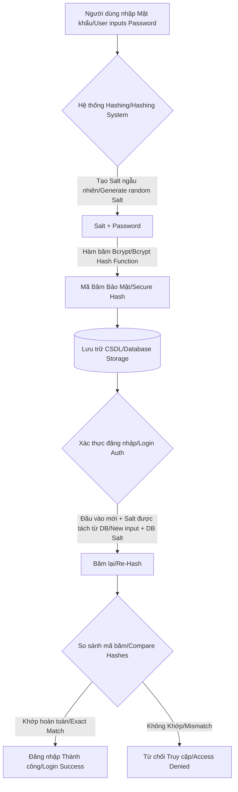
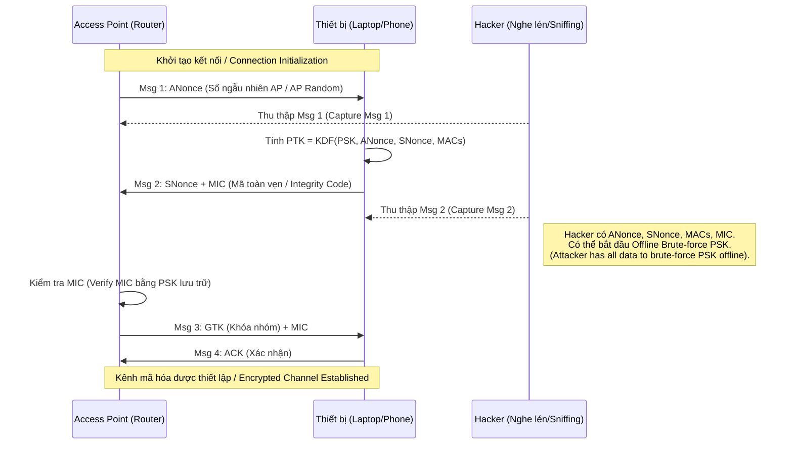

# Tuần 07: Cơ chế Mã hóa mật khẩu & Phân tích Giao thức Wi-Fi / Week 07: Password Hashing Mechanisms & Wi-Fi Protocol Security Analysis

## Mục Tiêu / Objectives

### Tiếng Việt
*   **Hiểu Rõ Bản Chất Của Hashing:** Phân biệt rõ ràng giữa mã hóa (encryption) và băm (hashing), tại sao băm mật khẩu một chiều lại an toàn.
*   **Salting & Peppering:** Nắm vững khái niệm về salt và pepper trong việc bảo vệ mật khẩu chống lại các cuộc tấn công Rainbow Table.
*   **Bảo Mật Mạng Wi-Fi:** Phân tích sự khác biệt giữa các giao thức WEP, WPA, WPA2, và WPA3 từ góc độ phòng thủ.
*   **Phân Tích Gói Tin Bắt Tay (Handshake Analysis):** Hiểu quá trình bắt tay 4 bước (4-way handshake) của WPA2 và cách các nhà phân tích bảo mật kiểm tra tính an toàn của mạng.
*   **Thực Hành Phòng Thủ:** Xây dựng một trình quản lý mật khẩu đơn giản (sử dụng hashing an toàn) và một trình phân tích gói tin Wi-Fi thụ động (passive analysis) để phát hiện thiết bị.
*   **Phân Tích Rủi Ro:** Đánh giá các kịch bản tấn công ngoại tuyến (offline attacks) và các biện pháp giảm thiểu.

### English
*   **Understand Hashing Fundamentals:** Clearly distinguish between encryption and hashing, and why one-way password hashing is secure.
*   **Salting & Peppering:** Master the concepts of salt and pepper in protecting passwords against Rainbow Table attacks.
*   **Wi-Fi Network Security:** Analyze the differences between WEP, WPA, WPA2, and WPA3 protocols from a defensive perspective.
*   **Handshake Packet Analysis:** Understand the WPA2 4-way handshake process and how security analysts verify network safety.
*   **Defensive Practice:** Build a simple password manager (using secure hashing) and a passive Wi-Fi packet analyzer to detect devices.
*   **Risk Analysis:** Evaluate offline attack scenarios and mitigation strategies.

---

## Linh Kiện & Dụng Cụ / Components & Tools

### Phần Cứng / Hardware
*   Máy tính xách tay (Laptop) / Desktop Computer (Windows/macOS/Linux).
*   (Tùy chọn/Optional) USB Wi-Fi Adapter hỗ trợ Monitor Mode (VD: Alfa AWUS036NHA) để thực hành phân tích gói tin sâu hơn. (Chỉ dùng cho mục đích phòng thủ / For defensive purposes only).
*   Thiết bị phát Wi-Fi (Router/Access Point) để thiết lập mạng thử nghiệm (Testbed).

### Phần Mềm / Software
*   Python 3.8+ (đã cài đặt / installed).
*   Thư viện Python (Python Libraries): `bcrypt`, `scapy`, `colorama`.
    *   Cài đặt / Installation: `pip install bcrypt scapy colorama`
*   Wireshark (Công cụ phân tích giao thức mạng / Network protocol analyzer).
*   Trình soạn thảo mã (Code Editor): VS Code, PyCharm, hoặc Sublime Text.

---

## Lý Thuyết / Theory

### 1. Cơ Chế Băm Mật Khẩu (Password Hashing Mechanisms)

#### Tiếng Việt
Lưu trữ mật khẩu dưới dạng văn bản gốc (plaintext) là một trong những lỗi bảo mật nghiêm trọng nhất. Nếu cơ sở dữ liệu bị lộ, toàn bộ tài khoản người dùng sẽ bị thỏa hiệp. Việc hiểu rõ cách lưu trữ mật khẩu an toàn là nền tảng của phát triển phần mềm an toàn.

*   **Hàm băm (Hash Function):** Là một thuật toán toán học chuyển đổi dữ liệu đầu vào (mật khẩu) có độ dài bất kỳ thành một chuỗi ký tự có độ dài cố định. Đặc điểm quan trọng nhất của hàm băm mật mã là tính **một chiều (one-way)**. Bạn không thể từ mã băm dịch ngược lại mật khẩu gốc.
    *   *Tính xác định (Deterministic):* Cùng một đầu vào luôn tạo ra cùng một đầu ra.
    *   *Chống va chạm (Collision Resistance):* Rất khó để tìm thấy hai đầu vào khác nhau tạo ra cùng một mã băm.
    *   *Ví dụ thuật toán:* MD5, SHA-1 (đã lỗi thời và KHÔNG an toàn cho mật khẩu), SHA-256, SHA-512, bcrypt, Argon2.
*   **Vấn đề với Băm cơ bản (The Problem with Basic Hashing):** Nếu hai người dùng có cùng mật khẩu (ví dụ: "123456"), mã băm của họ trong CSDL sẽ giống hệt nhau. Hacker có thể tính toán trước mã băm của hàng triệu mật khẩu phổ biến và lưu vào các bảng tra cứu khổng lồ gọi là **Rainbow Tables**. Khi CSDL bị lộ, họ chỉ việc tra cứu mã băm để tìm ra mật khẩu gần như ngay lập tức.
*   **Salting (Thêm muối):** Để vô hiệu hóa Rainbow Tables, chúng ta thêm một chuỗi ký tự ngẫu nhiên (gọi là *Salt*) vào mật khẩu trước khi băm.
    *   Mỗi người dùng sẽ có một Salt hoàn toàn ngẫu nhiên và riêng biệt.
    *   Salt này được lưu công khai cùng với mã băm trong database.
    *   Vì Salt ngẫu nhiên, dù hai người dùng có chung mật khẩu "123456", mã băm cuối cùng lưu trong database của họ cũng sẽ hoàn toàn khác nhau. Hacker buộc phải tạo lại Rainbow Table cho từng Salt riêng biệt, khiến cuộc tấn công trở nên bất khả thi về mặt tài nguyên tính toán.
*   **Peppering (Thêm tiêu):** Là một giá trị bí mật được thêm vào mật khẩu (ngoài Salt) trước khi băm.
    *   Khác với Salt, Pepper KHÔNG được lưu trong database. Nó được lưu trữ an toàn trong mã nguồn, hệ thống quản lý khóa (KMS), hoặc biến môi trường của máy chủ ứng dụng.
    *   Nếu hacker xâm nhập được database và đánh cắp mã băm (cùng Salt), họ vẫn không thể bẻ khóa vì thiếu giá trị Pepper.
*   **Thuật Toán Khuyên Dùng (Bcrypt, Argon2, PBKDF2):** Đây là các Hàm dẫn xuất khóa (Key Derivation Functions) được thiết kế để **cố tình chạy chậm**. Việc làm chậm quá trình băm (thông qua tham số cấu hình số vòng lặp) sẽ khiến các cuộc tấn công vét cạn (Brute-force) tốn quá nhiều thời gian đối với phần cứng của hacker (GPU/ASIC), nhưng chỉ mất khoảng vài trăm mili-giây cho máy chủ web để xác thực một người dùng hợp lệ.

#### English
Storing passwords in plaintext is one of the most critical security flaws. If a database is breached, all user accounts are compromised. Understanding secure password storage is the foundation of secure software development.

*   **Hash Function:** A mathematical algorithm that maps data of arbitrary size (the password) to a fixed-size string of characters. The most crucial characteristic of a cryptographic hash function is that it is **one-way**. You cannot reverse-engineer the original password from the hash.
    *   *Deterministic:* The same input always produces the exact same output.
    *   *Collision Resistance:* It is extremely difficult to find two different inputs that produce the same hash.
    *   *Algorithm examples:* MD5, SHA-1 (obsolete and INSECURE for passwords), SHA-256, SHA-512, bcrypt, Argon2.
*   **The Problem with Basic Hashing:** If two users share the same password (e.g., "123456"), their hashes in the database will be identical. Hackers pre-compute hashes for millions of common passwords and store them in massive lookup tables called **Rainbow Tables**. Upon a data breach, they simply look up the hashes to instantly reveal the passwords.
*   **Salting:** To defeat Rainbow Tables, we append a random string of characters (called a *Salt*) to the password before hashing it.
    *   Every user gets a completely unique and random Salt.
    *   This Salt is stored publicly alongside the hash in the database.
    *   Because the Salt is random, even if two users have the password "123456", their final stored hashes will be completely different. Hackers would have to compute a new Rainbow Table for every single Salt, rendering the attack computationally unfeasible.
*   **Peppering:** A secret value added to the password (in addition to the Salt) before hashing.
    *   Unlike Salt, Pepper is NOT stored in the database. It is stored securely in the source code, a Key Management System (KMS), or the application server's environment variables.
    *   If a hacker steals the database (hashes and salts), they still cannot crack the passwords without the Pepper value.
*   **Recommended Algorithms (Bcrypt, Argon2, PBKDF2):** These are Key Derivation Functions designed to be **intentionally slow**. Slowing down the hashing process (via an iteration count/work factor parameter) makes Brute-force attacks computationally expensive for hacker hardware (GPUs/ASICs), while only taking a fraction of a second for a web server to authenticate a legitimate user.

### 2. Phân Tích Giao Thức Wi-Fi (Wi-Fi Protocol Analysis)

#### Tiếng Việt
Mạng không dây (Wi-Fi) truyền tải dữ liệu qua sóng radio. Bản chất của việc này là phát sóng (broadcast) - bất kỳ ai có ăng-ten phù hợp nằm trong phạm vi phủ sóng đều có thể "bắt" (capture) các gói tin đang bay trong không khí. Do đó, mã hóa kênh truyền không chỉ là tùy chọn, nó là yếu tố sống còn để bảo vệ tính bảo mật và toàn vẹn của dữ liệu.

*   **WEP (Wired Equivalent Privacy):** Giao thức cũ nhất, xuất hiện vào cuối những năm 1990. Hiện tại nó đã hoàn toàn bị phá vỡ. WEP sử dụng mã hóa RC4 với khóa tĩnh hoặc khóa khởi tạo (IV - Initialization Vector) quá ngắn (24-bit). Một hacker có thể bẻ khóa mạng WEP chỉ trong vài phút bằng cách thu thập đủ lưu lượng mạng.
*   **WPA (Wi-Fi Protected Access):** Ra đời để thay thế tạm thời WEP, sử dụng TKIP (Temporal Key Integrity Protocol). TKIP thay đổi khóa mã hóa động trên mỗi gói tin, cải thiện bảo mật đáng kể nhưng vẫn tồn tại lỗ hổng kế thừa từ thuật toán cốt lõi RC4.
*   **WPA2 & AES-CCMP:** Tiêu chuẩn công nghiệp trong hơn một thập kỷ qua. Nó thay thế TKIP bằng AES (Advanced Encryption Standard), một chuẩn mã hóa cấp độ chính phủ cực kỳ an toàn.
    *   *Lỗ hổng cốt lõi của WPA2 (Vulnerabilities):* WPA2 sử dụng AES nên bảo vệ rất tốt chống lại việc giải mã dữ liệu thụ động. Tuy nhiên, điểm yếu của nó nằm ở khâu xác thực ban đầu, cụ thể là quá trình **WPA2 4-way Handshake**.
*   **Quá Trình Bắt Tay 4 Bước WPA2 (WPA2 4-Way Handshake Deep Dive):**
    Khi một thiết bị di động (Client) muốn kết nối với Access Point (AP), chúng cần thiết lập một Khóa Phiên (Session Key) để mã hóa dữ liệu. Chúng không bao giờ truyền thẳng mật khẩu Wi-Fi (PSK - Pre-Shared Key) dưới dạng văn bản rõ qua không khí.
    1.  **Thông điệp 1 (AP -> Client):** AP gửi một số ngẫu nhiên gọi là Anonce (Access Point Nonce) cho Client bằng dạng không mã hóa.
    2.  **Thông điệp 2 (Client -> AP):** Client tạo số ngẫu nhiên Snonce (Station Nonce). Sau đó, Client sử dụng PSK (Mật khẩu Wi-Fi), Anonce, Snonce, địa chỉ MAC của AP và địa chỉ MAC của Client để tính toán ra Khóa Mã Hóa (PTK - Pairwise Transient Key). Cuối cùng, Client gửi Snonce cùng với mã xác thực MIC (Message Integrity Code - được tính từ PTK) cho AP.
    3.  **Thông điệp 3 (AP -> Client):** AP (người cũng biết mật khẩu PSK) sẽ tự tính toán MIC từ phía mình. Nếu MIC của AP khớp với MIC do Client gửi, AP biết Client thực sự có mật khẩu đúng. Sau đó AP gửi Khóa Nhóm (GTK - Group Temporal Key) cùng MIC của nó cho Client.
    4.  **Thông điệp 4 (Client -> AP):** Client gửi gói tin xác nhận (ACK). Kết nối an toàn được thiết lập.
    *Góc độ phòng thủ (Defensive Perspective):* Một kẻ tấn công đang "nghe lén" có thể bắt được Thông điệp 1 và Thông điệp 2. Gói tin này chứa ANonce, SNonce, MAC AP, MAC Client, và MIC. Vì mật khẩu Wi-Fi (PSK) là thành phần duy nhất chưa biết dùng để tạo ra MIC, kẻ tấn công có thể mang 4 thông số kia về nhà, chạy một chương trình Brute-force offline (như hashcat hoặc aircrack-ng). Chương trình sẽ lấy từng mật khẩu trong từ điển, tự tính toán MIC và so sánh với MIC bắt được. Nếu khớp, mật khẩu đã bị lộ. Điều này nhấn mạnh tầm quan trọng tuyệt đối của việc sử dụng mật khẩu Wi-Fi dài và phức tạp.
*   **WPA3:** Chuẩn mới nhất hiện nay. Nó loại bỏ phương pháp bắt tay dễ bị tổn thương của WPA2 và sử dụng giao thức SAE (Simultaneous Authentication of Equals) dựa trên trao đổi khóa Dragonfly.
    *   SAE yêu cầu sự tương tác trực tiếp với Router cho mỗi lần đoán mật khẩu. Điều này khiến các cuộc tấn công từ điển ngoại tuyến (offline dictionary attacks) trở nên vô dụng. Ngay cả khi người dùng đặt mật khẩu yếu, mạng WPA3 vẫn an toàn hơn nhiều so với WPA2 trước các cuộc tấn công thu thập gói tin.

#### English
Wireless networks (Wi-Fi) transmit data via radio waves. The nature of this is broadcast - anyone with a suitable antenna within range can capture the packets flying through the air. Therefore, channel encryption is not optional; it is vital to protect data confidentiality and integrity.

*   **WEP (Wired Equivalent Privacy):** The oldest protocol from the late 1990s, now completely broken. WEP uses RC4 encryption with a static key or an Initialization Vector (IV) that is far too short (24-bit). A hacker can crack a WEP network in minutes by simply capturing enough network traffic.
*   **WPA (Wi-Fi Protected Access):** A temporary replacement for WEP, utilizing TKIP (Temporal Key Integrity Protocol). TKIP dynamically changes encryption keys per packet, vastly improving security but still retaining some vulnerabilities inherited from the core RC4 algorithm.
*   **WPA2 & AES-CCMP:** The industry standard for over a decade. It replaces TKIP with AES (Advanced Encryption Standard), a highly secure government-grade encryption standard.
    *   *Core Vulnerabilities of WPA2:* Because WPA2 uses AES, it protects very well against passive data decryption. However, its weakness lies in the initial authentication phase, specifically the **WPA2 4-way Handshake**.
*   **WPA2 4-Way Handshake Deep Dive:**
    When a mobile device (Client) wants to connect to an Access Point (AP), they need to establish a Session Key to encrypt data. They never transmit the actual Wi-Fi password (PSK - Pre-Shared Key) in plaintext over the air.
    1.  **Message 1 (AP -> Client):** The AP sends a random number called Anonce (Access Point Nonce) to the Client unencrypted.
    2.  **Message 2 (Client -> AP):** The Client generates a random number Snonce (Station Nonce). Then, the Client uses the PSK (Wi-Fi Password), Anonce, Snonce, AP MAC address, and Client MAC address to calculate the Encryption Key (PTK - Pairwise Transient Key). Finally, the Client sends the Snonce along with a Message Integrity Code (MIC - calculated using the PTK) to the AP.
    3.  **Message 3 (AP -> Client):** The AP (which also knows the PSK) calculates the MIC on its end. If the AP's MIC matches the Client's MIC, the AP knows the Client genuinely has the correct password. The AP then sends the Group Temporal Key (GTK) along with its MIC to the Client.
    4.  **Message 4 (Client -> AP):** The Client sends an acknowledgment (ACK). The secure channel is established.
    *Defensive Perspective:* An eavesdropping attacker can capture Message 1 and Message 2. This capture contains the ANonce, SNonce, AP MAC, Client MAC, and the MIC. Because the Wi-Fi password (PSK) is the only unknown component used to create the MIC, the attacker can take these 4 parameters home and run an offline Brute-force program (like hashcat or aircrack-ng). The program will take every password in a dictionary, compute the MIC, and compare it with the captured MIC. If they match, the password is cracked. This highlights the absolute importance of using long, complex Wi-Fi passwords.
*   **WPA3:** The current latest standard. It eliminates WPA2's vulnerable handshake and uses the SAE (Simultaneous Authentication of Equals) protocol based on the Dragonfly key exchange.
    *   SAE requires live interaction with the Router for every single password guess. This renders offline dictionary attacks on captured packets obsolete. Even if a user sets a weak password, a WPA3 network is significantly safer than WPA2 against packet capture attacks.

---

## Sơ Đồ Cấu Hình / Diagram

### Hệ Thống Quản Lý Mật Khẩu (Password Management System Flow)



### Quá Trình Bắt Tay WPA2 (WPA2 4-Way Handshake Flow)



---

## Thực Hành / Hands-On

### Bài 1: Cài đặt Hệ thống Băm Mật Khẩu An Toàn (Secure Password Hashing System)
**Mục tiêu (Objective):** Viết chương trình Python để mô phỏng một hệ thống đăng ký và đăng nhập bảo mật. Hệ thống này sẽ kiểm tra độ phức tạp của mật khẩu, sau đó băm nó một cách an toàn bằng `bcrypt` trước khi lưu vào cơ sở dữ liệu giả lập.

**Tiếng Việt:**
1. Mở IDE (VS Code, PyCharm).
2. Tạo một file Python tên là `secure_auth_manager.py`.
3. Sử dụng thư viện `re` (Regular Expressions) để kiểm tra độ mạnh của mật khẩu (phải có chữ, số, ký tự đặc biệt, độ dài tối thiểu).
4. Sử dụng thư viện `bcrypt` để tạo hash với salt tự động.
5. Viết chức năng menu cho phép người dùng: Đăng ký (Register), Đăng nhập (Login), và một chức năng mô phỏng hacker đánh cắp CSDL (để xem mã băm trông như thế nào).

**English:**
1. Open your IDE (VS Code, PyCharm).
2. Create a Python file named `secure_auth_manager.py`.
3. Use the `re` (Regular Expressions) library to enforce password strength policies (must contain letters, numbers, special characters, minimum length).
4. Use the `bcrypt` library to generate hashes with automatic salting.
5. Write a menu-driven program allowing users to: Register, Login, and a function simulating a database dump by a hacker (to observe what the hashes look like).

### Bài 2: Mô phỏng Thu thập Gói tin Wi-Fi thụ động (Passive Wi-Fi Sniffing Simulation)
**Mục tiêu (Objective):** Xây dựng một kịch bản sử dụng `scapy` để đọc luồng dữ liệu Wi-Fi, tập trung vào việc phát hiện các thiết bị đang tìm kiếm mạng xung quanh (Probe Requests). Điều này giúp hiểu cách thức dữ liệu bị lộ lọt trong không khí.

*Lưu ý (Note):* Việc bắt gói tin Wi-Fi trực tiếp yêu cầu card mạng vật lý hỗ trợ *Monitor Mode*. Do phần cứng của học viên đa dạng, kịch bản mẫu dưới đây được thiết kế để phân tích cấu trúc mã (code structure) hoặc phân tích một file `.pcap` có sẵn chứa các gói bắt tay thực tế.

**Tiếng Việt:**
1. Cài đặt thư viện: `pip install scapy colorama`
2. Tạo file `wifi_probe_analyzer.py`.
3. Sử dụng hàm `sniff()` của Scapy.
4. Lọc các gói tin chuẩn 802.11 (Dot11) và phân tách ra `Dot11Beacon` (Router phát mạng) và `Dot11ProbeReq` (Điện thoại tìm mạng).
5. Hiển thị thông tin trực quan trên Terminal.

**English:**
1. Install libraries: `pip install scapy colorama`
2. Create file `wifi_probe_analyzer.py`.
3. Utilize Scapy's `sniff()` function.
4. Filter 802.11 standard packets (Dot11) and separate them into `Dot11Beacon` (Routers broadcasting) and `Dot11ProbeReq` (Phones searching for networks).
5. Display the information visually on the Terminal.

---

## Code Mẫu / Code Samples

### Mẫu 1: `secure_auth_manager.py` - Hệ Thống Quản Lý Xác Thực (Authentication Management System)

```python
# secure_auth_manager.py
import bcrypt
import re
import time

# Giả lập Cơ sở dữ liệu (Simulated Database)
# Dictionary lưu trữ dạng: {'username': b'hashed_password_bytes'}
DATABASE = {}

def check_password_strength(password: str) -> bool:
    """
    Kiểm tra độ mạnh mật khẩu.
    Verify password strength requirements.
    Yêu cầu: Ít nhất 8 ký tự, có số, chữ hoa và chữ thường.
    """
    if len(password) < 8:
        print("[!] Lỗi: Mật khẩu phải có ít nhất 8 ký tự.")
        return False
    if not re.search(r"\d", password):
        print("[!] Lỗi: Mật khẩu phải chứa ít nhất một chữ số.")
        return False
    if not re.search(r"[A-Z]", password):
        print("[!] Lỗi: Mật khẩu phải chứa ít nhất một chữ in hoa.")
        return False
    return True

def register_user(username: str, plain_password: str):
    """
    Xử lý quá trình đăng ký: Kiểm tra -> Băm -> Lưu trữ.
    Handle registration: Check -> Hash -> Store.
    """
    if username in DATABASE:
        print("[-] Tên người dùng đã tồn tại!")
        return
        
    if not check_password_strength(plain_password):
        return

    print(f"[*] Đang xử lý băm mật khẩu cho user '{username}'...")
    start_time = time.time()
    
    # Bước băm (Hashing Step)
    # rounds=12 là độ trễ cấu hình (work factor). Số càng cao, quá trình băm càng chậm.
    salt = bcrypt.gensalt(rounds=12) 
    hashed_pw = bcrypt.hashpw(plain_password.encode('utf-8'), salt)
    
    end_time = time.time()
    
    # Lưu vào CSDL giả lập
    DATABASE[username] = hashed_pw
    
    print(f"[+] Đăng ký thành công! (Thời gian băm: {end_time - start_time:.4f} giây)")

def login_user(username: str, plain_password: str):
    """
    Xác thực người dùng khi đăng nhập.
    Authenticate user during login.
    """
    if username not in DATABASE:
        print("[-] Đăng nhập thất bại: Người dùng không tồn tại.")
        return

    stored_hash = DATABASE[username]
    print(f"[*] Đang xác thực mật khẩu cho '{username}'...")
    
    # Bcrypt sẽ tự động lấy salt từ stored_hash để băm lại plain_password và so sánh
    if bcrypt.checkpw(plain_password.encode('utf-8'), stored_hash):
        print("[+] Xác thực THÀNH CÔNG! Chào mừng vào hệ thống.")
    else:
        print("[-] Xác thực THẤT BẠI: Sai mật khẩu.")

def simulate_database_breach():
    """
    Hiển thị dữ liệu như cách một hacker nhìn thấy nếu CSDL bị đánh cắp.
    Show data as a hacker would see it if the DB is stolen.
    """
    print("\n" + "="*50)
    print("⚠️ CẢNH BÁO: CSDL BỊ RÒ RỈ (DATABASE LEAKED) ⚠️")
    print("="*50)
    if not DATABASE:
        print("CSDL trống.")
    for user, h_pass in DATABASE.items():
        print(f"User: {user:15} | Hash: {h_pass.decode('utf-8')}")
    print("="*50)
    print("Hacker hoàn toàn KHÔNG THỂ đọc được mật khẩu gốc từ các Hash này!")
    print("Họ phải dùng Rainbow Table hoặc Brute-force offline.")
    print("="*50 + "\n")

# --- Menu chính / Main Menu ---
if __name__ == "__main__":
    while True:
        print("\n--- HỆ THỐNG XÁC THỰC BẢO MẬT ---")
        print("1. Đăng ký tài khoản (Register)")
        print("2. Đăng nhập (Login)")
        print("3. Mô phỏng Hack CSDL (Simulate Database Breach)")
        print("4. Thoát (Exit)")
        choice = input("Chọn chức năng: ")
        
        if choice == '1':
            usr = input("Nhập username mới: ")
            pwd = input("Nhập password mới: ")
            register_user(usr, pwd)
        elif choice == '2':
            usr = input("Username: ")
            pwd = input("Password: ")
            login_user(usr, pwd)
        elif choice == '3':
            simulate_database_breach()
        elif choice == '4':
            print("Thoát chương trình.")
            break
        else:
            print("Lựa chọn không hợp lệ.")
```

### Mẫu 2: `wifi_probe_analyzer.py` - Công Cụ Phân Tích Probe Request (Probe Request Analyzer)

*Yêu cầu (Requirements): Scapy thư viện. Kịch bản này được tối ưu để chỉ in ra cấu trúc khi không có interface Monitor Mode.*

```python
# wifi_probe_analyzer.py
from scapy.all import sniff
from scapy.layers.dot11 import Dot11, Dot11Beacon, Dot11ProbeReq
try:
    from colorama import Fore, Style, init
    init(autoreset=True)
except ImportError:
    # Fallback nếu không có colorama / Fallback if colorama is missing
    class Fore: RED = ''; GREEN = ''; YELLOW = ''; CYAN = ''
    class Style: RESET_ALL = ''

# Biến lưu trữ (Storage variables)
seen_networks = set()
seen_devices = set()

def analyze_wifi_packet(packet):
    """
    Hàm callback xử lý từng gói tin nhận được.
    Callback function processing each received packet.
    """
    # Đảm bảo gói tin thuộc lớp Wi-Fi
    if packet.haslayer(Dot11):
        
        # 1. Phát hiện Access Point (Beacon Frames)
        if packet.haslayer(Dot11Beacon):
            bssid = packet[Dot11].addr2 # MAC Address của Router
            try:
                # Trích xuất tên Wi-Fi (SSID)
                ssid = packet.info.decode('utf-8', errors='ignore')
            except:
                ssid = "<Hidden>"
                
            if bssid not in seen_networks:
                seen_networks.add(bssid)
                print(f"{Fore.GREEN}[+] Access Point Mới:{Style.RESET_ALL} MAC: {bssid} | SSID: {Fore.YELLOW}{ssid}")
                
        # 2. Phát hiện thiết bị di động đang dò tìm mạng (Probe Requests)
        elif packet.haslayer(Dot11ProbeReq):
            client_mac = packet[Dot11].addr2 # MAC Address của điện thoại/laptop
            try:
                # Tên mạng mà thiết bị đang tìm kiếm (thường là mạng đã kết nối trong quá khứ)
                searched_ssid = packet.info.decode('utf-8', errors='ignore')
            except:
                searched_ssid = ""
                
            if searched_ssid: # Bỏ qua các yêu cầu trống
                print(f"{Fore.CYAN}[*] Thiết Bị Dò Mạng:{Style.RESET_ALL} MAC: {client_mac} đang tìm kiếm mạng: {Fore.RED}'{searched_ssid}'")

if __name__ == "__main__":
    print(f"{Fore.CYAN}==================================================")
    print("WI-FI PROBE & BEACON ANALYZER (DEFENSIVE SCRIPT)")
    print("Phát hiện Router đang phát sóng và Thiết bị đang dò mạng")
    print(f"=================================================={Style.RESET_ALL}")
    
    # CHÚ Ý QUAN TRỌNG VỀ THỰC THI (CRITICAL EXECUTION NOTES):
    print("Để chạy script này thu thập gói tin THỰC TẾ, bạn cần:")
    print("1. Chạy Terminal dưới quyền Admin/Root (sudo).")
    print("2. Chuyển card Wi-Fi sang chế độ Monitor Mode.")
    print("Lệnh tham khảo (Linux): sudo airmon-ng start wlan0\n")
    
    interface_name = input("Nhập tên interface Monitor (VD: wlan0mon) hoặc nhấn Enter để bỏ qua chế độ live: ")
    
    if interface_name.strip():
        try:
            print(f"\n[*] Đang lắng nghe trên interface {interface_name}... (Nhấn Ctrl+C để dừng)")
            # Bắt đầu thu thập dữ liệu / Start sniffing
            sniff(iface=interface_name, prn=analyze_wifi_packet, store=False)
        except Exception as e:
            print(f"{Fore.RED}[!] Lỗi cấu hình mạng: {e}")
            print("Đảm bảo bạn có quyền root và card mạng hỗ trợ Monitor Mode.")
    else:
        print("\n[!] Bỏ qua chế độ Live Sniffing. Script đã sẵn sàng về mặt logic.")
        print("Trong khóa học, giảng viên sẽ biểu diễn quá trình này qua máy chiếu bằng thiết bị chuyên dụng.")
```

---

## Câu Hỏi Thảo Luận / Discussion

### Tiếng Việt
1.  **Tại sao chúng ta không dùng mã hóa hai chiều (như AES) để lưu mật khẩu trong cơ sở dữ liệu?**
    *(Gợi ý: Thuật toán mã hóa AES yêu cầu một chìa khóa bí mật (Secret Key) để mã hóa và giải mã. Nếu hệ thống bị tấn công và hacker lấy được toàn bộ cơ sở dữ liệu kèm theo chìa khóa bí mật (thường lưu ở server), chúng có thể giải mã 100% tài khoản. Với Hashing, không có "chìa khóa" nào để giải ngược.)*
2.  **Giả sử một kẻ tấn công thu thập được gói tin 4-way Handshake WPA2. Mật khẩu Wi-Fi của nạn nhân là `s#cuRe_W!F!_2026_xYz`. Hacker có thể bẻ khóa được không? Tại sao?**
    *(Gợi ý: Về lý thuyết là có, nhưng về mặt thực tế là KHÔNG. Hacker phải chạy brute-force offline. Thuật toán PBKDF2 của WPA2 khiến việc đoán mỗi mật khẩu tốn thời gian. Với độ dài và tính phức tạp như trên, việc kết hợp các ký tự sẽ vượt quá khả năng tính toán của mọi siêu máy tính hiện tại trong một thời gian hợp lý (có thể mất hàng tỷ năm).)*
3.  **Hành động các thiết bị di động (điện thoại) liên tục phát ra "Probe Requests" chứa tên các mạng Wi-Fi cũ (như 'Wifi Nha', 'CongTy_ABC') có gây ra rủi ro quyền riêng tư nào không?**
    *(Gợi ý: Có. Bất kỳ ai cầm một thiết bị dò tìm (sniffer) cũng có thể theo dõi vị trí lịch sử và những nơi bạn từng đến dựa vào tên các mạng Wi-Fi lưu trong máy bạn, tạo thành một hồ sơ theo dõi (tracking profile).)*

### English
1.  **Why do we not use two-way encryption (like AES) to store passwords in a database?**
    *(Hint: AES encryption requires a Secret Key for encryption and decryption. If the system is breached and a hacker obtains the database along with the secret key (often stored on the server), they can decrypt 100% of the accounts. With one-way Hashing, there is no "key" to reverse the process.)*
2.  **Suppose an attacker captures a WPA2 4-way Handshake. The victim's Wi-Fi password is `s#cuRe_W!F!_2026_xYz`. Can the hacker crack it? Why or why not?**
    *(Hint: Theoretically yes, but practically NO. The hacker must perform offline brute-forcing. The PBKDF2 algorithm in WPA2 makes each guess computationally slow. Given the length and complexity of that password, the number of combinations would exceed the computing power of any modern supercomputer within a reasonable timeframe (it could take billions of years).)*
3.  **Does the act of mobile devices (phones) constantly broadcasting "Probe Requests" containing names of past Wi-Fi networks (e.g., 'Home Network', 'Company_ABC') pose a privacy risk?**
    *(Hint: Yes. Anyone holding a sniffer can track your historical locations and places you've visited based on the Wi-Fi network names stored in your device, effectively building a tracking profile.)*

---

## Bài Về Nhà / Homework

### Bài Tập 1: Nâng Cấp Hệ Thống Bảo Mật (Security System Upgrade)
Dựa vào mã nguồn `secure_auth_manager.py`, hãy thực hiện các nâng cấp sau:
1.  **Thêm tính năng Delay (Chống Brute-force Online):** Trong hàm `login_user`, nếu người dùng nhập sai mật khẩu, hãy bắt chương trình "ngủ" (sử dụng `time.sleep(2)`) trong 2 giây trước khi cho phép họ thử lại. Điều này giúp ngăn chặn các cuộc tấn công đoán mật khẩu liên tục qua mạng.
2.  **Khóa Tài Khoản (Account Lockout):** Cải tiến hệ thống để theo dõi số lần đăng nhập sai. Nếu một `username` đăng nhập sai quá 3 lần liên tiếp, hãy in ra thông báo: `"Tài khoản đã bị khóa tạm thời."` và không cho phép đăng nhập nữa, cho dù họ nhập đúng.

*(Based on `secure_auth_manager.py`, upgrade the system by: 1. Adding a 2-second delay on failed logins to prevent online brute-forcing. 2. Implementing an account lockout feature after 3 consecutive failed login attempts).*

### Bài Tập 2: Phân Tích Thông Tin Tình Báo Nguồn Mở (OSINT) trên Wireshark (Không Yêu Cầu Monitor Mode)
*(Wireshark OSINT Analysis - No Monitor Mode Required)*
1. Tải và cài đặt Wireshark trên máy tính của bạn.
2. Khởi động Wireshark, chọn Interface (Wi-Fi hoặc Ethernet) mà máy tính bạn đang dùng để vào mạng.
3. Bắt đầu thu thập gói tin.
4. Mở trình duyệt ẩn danh, truy cập vào một trang web HTTP không bảo mật, ví dụ: `http://example.com`.
5. Quay lại Wireshark, dừng thu thập.
6. Sử dụng bộ lọc (filter) trên thanh tìm kiếm: gõ chữ `http` và nhấn Enter.
7. Tìm gói tin có chứa chữ `GET / HTTP/1.1`.
8. Nhấp đúp vào gói tin đó để xem chi tiết.
9. **Yêu cầu Báo cáo:** Chụp màn hình khu vực hiển thị nội dung "Hypertext Transfer Protocol" để chứng minh rằng, đối với kết nối không mã hóa (HTTP), bất kỳ ai theo dõi mạng cũng có thể đọc được chính xác dữ liệu bạn đang yêu cầu/gửi đi (đây gọi là dạng văn bản rõ - plaintext).

*(1. Install Wireshark. 2. Select active network interface. 3. Start capture. 4. Visit unencrypted `http://example.com`. 5. Stop capture. 6. Filter by `http`. 7. Find `GET / HTTP/1.1` packet. 8. Inspect details. 9. Report requirement: Take a screenshot of the HTTP section to prove that unencrypted traffic can be easily read in plaintext by anyone sniffing the network).*

---

## Đánh Giá / Assessment Rubric

| Tiêu chí / Criteria | Điểm / Points | Xuất sắc (Excellent) (100%) | Đạt (Pass) (70%) | Cần Cải Thiện (Needs Improv.) (0-40%) |
| :--- | :---: | :--- | :--- | :--- |
| **Lý thuyết Hashing / Hashing Theory** | 25 | Giải thích sâu sắc về thuật toán (Bcrypt), Salt, Pepper và lý do không dùng mã hóa AES. (Deeply explains Bcrypt, Salt, Pepper, and why AES isn't used). | Trình bày được khái niệm Hashing cơ bản, phân biệt với Encryption. (Presents basic Hashing concept, distinguishes from Encryption). | Nhầm lẫn hoàn toàn giữa Hashing và Encryption. (Completely confuses Hashing and Encryption). |
| **Thực hành Python / Python Hands-On** | 30 | Hoàn thành nâng cấp chương trình `secure_auth_manager.py` (Delay, Lockout), mã chạy mượt mà không lỗi. (Completes program upgrade with Delay & Lockout, code runs flawlessly). | Chạy thành công code mẫu `secure_auth_manager.py` và hiểu luồng hoạt động. (Successfully runs sample code and understands the flow). | Không chạy được code Python, hoặc không hiểu đoạn mã làm gì. (Cannot run Python code, or doesn't understand it). |
| **Bảo mật Wi-Fi / Wi-Fi Security Concepts** | 25 | Phân tích chi tiết rủi ro của quy trình WPA2 4-way handshake và đánh giá tầm quan trọng của WPA3. (Analyzes WPA2 handshake risks in detail and assesses WPA3 importance). | Nhận biết được sự khác biệt cơ bản giữa WEP, WPA, WPA2. (Identifies basic differences between WEP, WPA, WPA2). | Không hiểu cơ chế bắt tay hoặc bản chất phát sóng của mạng không dây. (Does not understand handshakes or broadcast nature). |
| **Phân tích Gói tin / Packet Analysis (Wireshark)**| 20 | Hoàn thành xuất sắc bài tập Wireshark HTTP, phân tích rõ ràng luồng dữ liệu (Plaintext) với ảnh chụp màn hình chứng minh. (Excellently completes Wireshark HTTP exercise, clearly analyzing plaintext flow with proof). | Cài đặt, mở được Wireshark và thiết lập được filter cơ bản. (Installs Wireshark and sets up basic filter). | Không tải/cài đặt được phần mềm hoặc bỏ qua bài tập thực hành. (Fails to install software or skips practical exercise). |

---
*Bản quyền tài liệu thuộc về chương trình đào tạo Aero-Fullstack4kid.*
*Document copyright belongs to Aero-Fullstack4kid training program.*
*End of Document / Hết tài liệu.*

---

## Phụ Lục Chuyên Sâu (Deep-Dive Appendix): Hashing Algorithm Comparison & WPA3 Mechanics

### 1. Bảng So Sánh Các Thuật Toán Băm Mật Khẩu (Password Hashing Comparison)

| Thuật Toán | Trạng Thái An Toàn | Work Factor / Cost Factor | Đánh Giá Phòng Thủ |
| :--- | :--- | :--- | :--- |
| **MD5 / SHA-1** | ❌ KHÔNG AN TOÀN | Rất nhanh (NANO-giây) | Tuyệt đối không dùng cho mật khẩu (Dễ bị Rainbow Table / GPU Crack). |
| **SHA-256 / SHA-512**| ⚠️ KHÔNG KHUYÊN DÙNG | Nhanh (MICRO-giây) | Phù hợp kiểm tra tính toàn vẹn file, nhưng không an toàn cho mật khẩu nếu không có Salt/KDF. |
| **PBKDF2** | ✅ AN TOÀN | Tùy chỉnh (Iterations: 100,000+) | Tiêu chuẩn của NIST, hỗ trợ tốt trên nhiều nền tảng cũ. |
| **Bcrypt** | 🛡️ RẤT AN TOÀN | Tùy chỉnh (Work Factor: 10-14) | Thuật toán chuẩn mực cho Web App, tự động sinh Salt 128-bit. |
| **Argon2** | 🏆 AN TOÀN NHẤT | Tùy chỉnh (Memory & Time cost) | Quán quân Password Hashing Competition (PHC), chống lại tấn công phần cứng GPU/ASIC. |

### 2. Sự Khác Biệt Giữa WPA2 và WPA3

- **WPA2 (4-Way Handshake):** Dễ bị bắt gói tin Handshake và bẻ khóa từ điển ngoại tuyến (Offline Dictionary Attack).
- **WPA3 (SAE - Simultaneous Authentication of Equals):** Sử dụng cơ chế trao đổi khóa Dragonfly. Mỗi lần thử mật khẩu yêu cầu tương tác trực tiếp với Access Point, vô hiệu hóa các công cụ bẻ khóa từ điển offline.
## Code minh họa theo buổi

- [Danh sách 20 code tuần 07](../code/week07/README.md) — học lần lượt từ `01_...` đến `20_...`.
## 20 code minh họa của tuần

- [Mở mục lục code tuần 07](../code/week07/README.md), học lần lượt từ `01_...` đến `20_...`.

<!-- AUTO-GENERATED-WEEKLY-CODE -->
## 20 code minh họa của tuần

- [Mở mục lục code tuần 07](../code/week07/README.md), học lần lượt từ `01_...` đến `20_...`.
