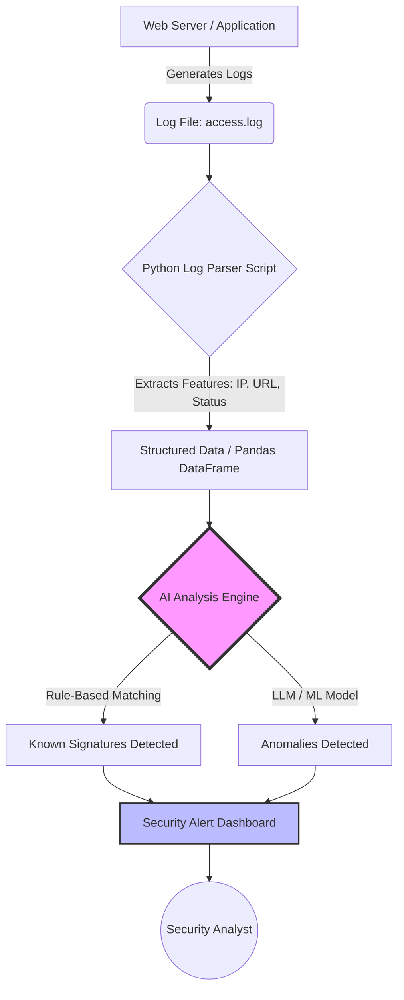

# Tuần 09: Kiểm toán mã nguồn và Phân tích nhật ký bảo mật bằng AI / Week 09: Secure Code Auditing & Security Log Analysis using AI

## 1. Mục Tiêu / Objectives

### Tiếng Việt (Vietnamese)
- **Hiểu về Kiểm toán Mã nguồn An toàn:** Nắm bắt các nguyên tắc cơ bản của việc viết mã an toàn và cách kiểm tra mã nguồn để phát hiện các lỗ hổng bảo mật phổ biến (như SQL Injection, XSS) từ góc độ phòng thủ.
- **Tầm quan trọng của Nhật ký Bảo mật (Security Logs):** Hiểu được vai trò của log trong việc giám sát, phát hiện và phản ứng với các sự cố an ninh mạng.
- **Phân tích Nhật ký (Log Analysis):** Học cách đọc, phân tích và trích xuất thông tin hữu ích từ các tệp log tiêu chuẩn (ví dụ: log máy chủ web Apache/Nginx).
- **Ứng dụng AI trong Phòng thủ:** Sử dụng Trí tuệ Nhân tạo (Machine Learning/LLMs) để tự động hóa việc phân tích log, phát hiện các hành vi bất thường và phân tích mã nguồn.

### English
- **Understand Secure Code Auditing:** Grasp the fundamental principles of secure coding and how to audit source code to detect common security vulnerabilities (like SQL Injection, XSS) from a defensive perspective.
- **Importance of Security Logs:** Understand the role of logs in monitoring, detecting, and responding to cybersecurity incidents.
- **Log Analysis:** Learn how to read, parse, and extract actionable intelligence from standard log files (e.g., Apache/Nginx web server logs).
- **AI Applications in Defense:** Utilize Artificial Intelligence (Machine Learning/LLMs) to automate log analysis, detect anomalous behaviors, and assist in secure code review.

---

## 2. Linh Kiện & Dụng Cụ / Components & Tools

### Tiếng Việt (Vietnamese)
1. **Phần cứng:**
   - Máy tính cá nhân (Windows, macOS, hoặc Linux).
   - Kết nối Internet ổn định.
2. **Phần mềm & Môi trường:**
   - Trình thông dịch Python 3.x (Python 3.8 trở lên).
   - Trình soạn thảo mã (Visual Studio Code, PyCharm, hoặc Sublime Text).
   - Thư viện Python cần thiết: `pandas`, `requests`, `scikit-learn` (để mô phỏng phát hiện bất thường cơ bản), và thư viện API của LLM (ví dụ: `google-generativeai` hoặc `openai`).
3. **Tài liệu tham khảo:**
   - Các đoạn mã mẫu có chứa lỗi bảo mật (cố ý) để thực hành kiểm toán.
   - Tập dữ liệu log máy chủ web giả lập chứa các truy cập bình thường và các dấu hiệu tấn công.

### English
1. **Hardware:**
   - Personal Computer (Windows, macOS, or Linux).
   - Stable Internet connection.
2. **Software & Environments:**
   - Python 3.x interpreter (Python 3.8+).
   - Code editor (Visual Studio Code, PyCharm, or Sublime Text).
   - Required Python libraries: `pandas`, `requests`, `scikit-learn` (for basic anomaly detection simulation), and LLM API client (e.g., `google-generativeai` or `openai`).
3. **Reference Materials:**
   - Sample code snippets containing intentional security flaws for auditing practice.
   - Simulated web server log datasets containing both benign traffic and attack signatures.

---

## 3. Lý Thuyết / Theory

### 3.1. Kiểm Toán Mã Nguồn An Toàn (Secure Code Auditing)

#### Tiếng Việt
Kiểm toán mã nguồn là quá trình xem xét mã nguồn của một ứng dụng để tìm ra các lỗi, vi phạm tiêu chuẩn, và đặc biệt là các lỗ hổng bảo mật. Từ góc độ phòng thủ, mục tiêu là tìm và sửa lỗi trước khi ứng dụng được triển khai, giảm thiểu rủi ro bị tấn công.

Các lỗ hổng phổ biến cần chú ý:
- **Injection (Đưa mã độc):** Đặc biệt là SQL Injection. Xảy ra khi dữ liệu đầu vào từ người dùng không được kiểm tra kỹ mà được đưa thẳng vào câu lệnh truy vấn cơ sở dữ liệu. **Cách phòng thủ:** Sử dụng Prepared Statements (Câu lệnh chuẩn bị) hoặc Parameterized Queries.
- **Cross-Site Scripting (XSS):** Xảy ra khi ứng dụng web hiển thị dữ liệu chưa qua xử lý từ người dùng, cho phép kẻ tấn công chạy mã JavaScript độc hại trên trình duyệt của nạn nhân. **Cách phòng thủ:** Mã hóa đầu ra (Output Encoding) và Kiểm tra đầu vào (Input Validation).
- **Hardcoded Secrets (Bí mật bị mã hóa cứng):** Lưu trữ mật khẩu, khóa API trực tiếp trong mã nguồn. **Cách phòng thủ:** Sử dụng biến môi trường (Environment Variables) hoặc các dịch vụ quản lý khóa (Secret Managers).

#### English
Secure code auditing is the process of reviewing an application's source code to discover bugs, standards violations, and specifically security vulnerabilities. From a defensive standpoint, the goal is to find and patch flaws before deployment, minimizing attack risks.

Common vulnerabilities to look for:
- **Injection Flaws:** Notably SQL Injection. Occurs when untrusted user input is directly concatenated into database queries. **Defensive approach:** Use Prepared Statements or Parameterized Queries.
- **Cross-Site Scripting (XSS):** Happens when a web application includes unvalidated and unescaped user input in its output, allowing attackers to execute malicious JavaScript in victims' browsers. **Defensive approach:** Context-aware Output Encoding and Input Validation.
- **Hardcoded Secrets:** Storing passwords, API keys, or tokens directly in the source code. **Defensive approach:** Use Environment Variables or dedicated Secret Management services.

### 3.2. Nhật Ký Bảo Mật & Phân Tích (Security Logs & Analysis)

#### Tiếng Việt
Nhật ký (Logs) là các bản ghi chi tiết về các sự kiện xảy ra trong một hệ thống máy tính. Nhật ký bảo mật cung cấp bằng chứng quan trọng để phát hiện xâm nhập, kiểm toán và điều tra pháp y kỹ thuật số (Forensics).

- **Web Server Logs:** Ghi lại mọi yêu cầu (request) gửi đến máy chủ web. Bao gồm địa chỉ IP, thời gian, phương thức HTTP (GET/POST), URL, mã trạng thái (200, 404, 500), và User-Agent.
- **Security Information and Event Management (SIEM):** Các hệ thống thu thập log từ nhiều nguồn, phân tích và đưa ra cảnh báo bảo mật.
- **Phân tích Log:** Quá trình tìm kiếm các mẫu bất thường. Ví dụ: Rất nhiều lỗi 404 từ một IP trong thời gian ngắn có thể là dấu hiệu của việc quét thư mục (Directory Brute-forcing). Các ký tự lạ như `' OR 1=1` trong URL là dấu hiệu của SQL Injection.

#### English
Logs are detailed records of events occurring within a computer system. Security logs provide critical evidence for intrusion detection, auditing, and digital forensics.

- **Web Server Logs:** Record every request sent to the web server. Includes IP address, timestamp, HTTP method (GET/POST), URL, status code (200, 404, 500), and User-Agent.
- **Security Information and Event Management (SIEM):** Systems that collect logs from various sources, analyze them, and generate security alerts.
- **Log Analysis:** The process of searching for anomalous patterns. For example: Many 404 errors from a single IP in a short period might indicate directory brute-forcing. Suspicious characters like `' OR 1=1` in the URL strongly suggest an SQL Injection attempt.

### 3.3. Ứng Dụng AI Trong Phòng Thủ Bảo Mật (AI in Defensive Security)

#### Tiếng Việt
Trí tuệ nhân tạo đang cách mạng hóa cách chúng ta phòng thủ:
- **Phát hiện bất thường (Anomaly Detection):** Các mô hình Machine Learning có thể học mẫu hành vi "bình thường" của một hệ thống. Bất kỳ hành vi nào sai lệch (ví dụ: đăng nhập vào lúc 3 giờ sáng từ một quốc gia khác) sẽ bị gắn cờ là đáng ngờ.
- **Phân tích ngữ nghĩa log:** Các mô hình ngôn ngữ lớn (LLMs) có thể đọc các dòng log thô và giải thích chúng bằng ngôn ngữ tự nhiên, giúp các nhà phân tích bảo mật hiểu nhanh vấn đề.
- **Hỗ trợ Code Review:** AI có thể phân tích mã nguồn, phát hiện các lỗ hổng tiềm ẩn và thậm chí đề xuất các bản vá an toàn.

#### English
Artificial Intelligence is revolutionizing defensive capabilities:
- **Anomaly Detection:** Machine Learning models can learn the "normal" behavioral baseline of a system. Any deviation (e.g., a login at 3 AM from a foreign country) is flagged as suspicious.
- **Semantic Log Analysis:** Large Language Models (LLMs) can parse raw log lines and explain them in natural language, enabling security analysts to rapidly understand incidents.
- **Code Review Assistance:** AI can audit source code, identify potential vulnerabilities, and even suggest secure code remediations.

---

## 4. Sơ Đồ Cấu Hình / Diagram

Dưới đây là sơ đồ luồng dữ liệu mô tả cách hệ thống phòng thủ sử dụng AI phân tích nhật ký.
Below is a data flow diagram illustrating how a defensive system uses AI for log analysis.



---

## 5. Thực Hành / Hands-On

### Tiếng Việt

**Bài 1: Tạo dữ liệu Log giả lập (Mock Log Data)**
1. Tạo một tệp văn bản tên là `sample_access.log`.
2. Sao chép một vài dòng log giả lập (có chứa cả truy cập bình thường và truy cập độc hại) vào tệp này.
3. Chúng ta sẽ đóng vai trò người quản trị hệ thống phát hiện tấn công.

**Bài 2: Viết Script Python phân tích Log cơ bản**
1. Mở IDE của bạn và tạo một tệp `log_analyzer.py`.
2. Sử dụng thư viện `re` (Regular Expressions) để phân tích (parse) từng dòng log và trích xuất IP, Thời gian, Request, và Mã trạng thái.
3. Thống kê số lượng truy cập từ mỗi IP.

**Bài 3: Sử dụng AI để đánh giá Log**
1. Đăng ký lấy API Key miễn phí (ví dụ từ Google Gemini hoặc OpenAI).
2. Viết hàm Python gửi những dòng log có dấu hiệu đáng ngờ (ví dụ mã trạng thái 400 hoặc 500) tới AI.
3. Yêu cầu AI (thông qua Prompt) đánh giá xem đó có phải là một nỗ lực tấn công hay không.

### English

**Task 1: Create Mock Log Data**
1. Create a text file named `sample_access.log`.
2. Copy several simulated log lines (containing both normal traffic and malicious requests) into this file.
3. We will act as system administrators detecting attacks.

**Task 2: Write a Basic Python Log Analysis Script**
1. Open your IDE and create a file `log_analyzer.py`.
2. Use the `re` (Regular Expressions) library to parse each log line and extract the IP, Timestamp, Request, and Status Code.
3. Count the number of requests originating from each IP address.

**Task 3: Use AI to Evaluate Logs**
1. Obtain a free API Key (e.g., from Google Gemini or OpenAI).
2. Write a Python function to send suspicious log lines (e.g., status codes 400 or 500) to the AI model.
3. Instruct the AI (via a Prompt) to evaluate whether the log line represents an attack attempt.

---

## 6. Code Mẫu / Code Samples

### 6.1. Dữ liệu giả lập `sample_access.log` (Mock Data)

Lưu nội dung sau vào file `sample_access.log`:
Save the following content to `sample_access.log`:

```text
192.168.1.10 - - [10/Oct/2026:13:55:36 +0700] "GET /index.html HTTP/1.1" 200 2326
192.168.1.15 - - [10/Oct/2026:13:55:40 +0700] "GET /images/logo.png HTTP/1.1" 200 4523
10.0.0.55 - - [10/Oct/2026:13:56:01 +0700] "GET /admin/login.php HTTP/1.1" 200 1204
10.0.0.55 - - [10/Oct/2026:13:56:05 +0700] "POST /admin/login.php HTTP/1.1" 401 532
10.0.0.55 - - [10/Oct/2026:13:56:10 +0700] "POST /admin/login.php HTTP/1.1" 401 532
10.0.0.55 - - [10/Oct/2026:13:56:15 +0700] "POST /admin/login.php HTTP/1.1" 401 532
203.0.113.42 - - [10/Oct/2026:14:02:11 +0700] "GET /product.php?id=1%20OR%201=1 HTTP/1.1" 500 123
203.0.113.42 - - [10/Oct/2026:14:02:15 +0700] "GET /etc/passwd HTTP/1.1" 404 231
192.168.1.10 - - [10/Oct/2026:14:05:00 +0700] "GET /contact.html HTTP/1.1" 200 3102
```

### 6.2. Script Phân Tích Log & Tích hợp AI `log_analyzer.py`

*Lưu ý: Bạn cần thay thế `YOUR_API_KEY` bằng API key thật của bạn.*
*Note: You need to replace `YOUR_API_KEY` with your actual API key.*

```python
import re
from collections import Counter
import json
# Giả sử sử dụng thư viện requests để gọi API AI giả lập (hoặc thay bằng thư viện chuẩn của nhà cung cấp)
# Assuming requests library is used for a mock AI API call (or replace with vendor SDK)
import requests

LOG_FILE = 'sample_access.log'

# Regular Expression để bóc tách (parse) định dạng log Apache/Nginx tiêu chuẩn
# Regex to parse standard Apache/Nginx combined log format
LOG_PATTERN = re.compile(
    r'(?P<ip>\d+\.\d+\.\d+\.\d+) - - \[(?P<timestamp>.*?)\] '
    r'"(?P<method>\S+) (?P<url>\S+) (?P<protocol>\S+)" '
    r'(?P<status>\d{3}) (?P<size>\S+)'
)

def parse_logs(file_path):
    """
    Tiếng Việt: Đọc file log và trích xuất thông tin.
    English: Read the log file and extract information.
    """
    parsed_data = []
    with open(file_path, 'r') as f:
        for line in f:
            match = LOG_PATTERN.match(line)
            if match:
                parsed_data.append(match.groupdict())
    return parsed_data

def detect_basic_anomalies(logs):
    """
    Tiếng Việt: Phát hiện bất thường cơ bản bằng các quy tắc (Rule-based).
    English: Detect basic anomalies using rules.
    """
    ip_counter = Counter([log['ip'] for log in logs])
    
    print("--- Thống kê truy cập theo IP (IP Access Stats) ---")
    for ip, count in ip_counter.items():
        print(f"IP: {ip} - Yêu cầu (Requests): {count}")
        
    suspicious_logs = []
    for log in logs:
        # Quy tắc: Mã lỗi 40x hoặc 50x, hoặc URL chứa dấu hiệu tấn công
        # Rule: 40x or 50x errors, or URLs containing attack signatures
        status = int(log['status'])
        url = log['url'].lower()
        if status >= 400 or "or 1=1" in url or "etc/passwd" in url:
            suspicious_logs.append(log)
            
    return suspicious_logs

def analyze_with_ai(log_entry, api_key="YOUR_API_KEY"):
    """
    Tiếng Việt: Gửi log đáng ngờ cho AI để phân tích sâu hơn.
    English: Send suspicious logs to AI for deeper analysis.
    Lưu ý: Đây là mã giả lập (mock API call).
    Note: This is a simulated API call.
    """
    prompt = f"""
    You are a defensive cybersecurity expert. Analyze the following web server log entry.
    Identify if it indicates an attack, and if so, what type of attack (e.g., SQLi, LFI, Brute Force).
    Log Entry: {json.dumps(log_entry)}
    Provide a very brief 1-2 sentence explanation.
    """
    
    print(f"\n[AI Analysis Request for IP {log_entry['ip']} requesting {log_entry['url']}]")
    print("Prompting AI...")
    
    # -------------------------------------------------------------------
    # THAY THẾ PHẦN NÀY BẰNG MÃ GỌI API THỰC TẾ (ví dụ: OpenAI, Gemini)
    # REPLACE THIS SECTION WITH ACTUAL API CALL CODE
    # -------------------------------------------------------------------
    # Mock Response for demonstration purposes:
    mock_response = ""
    if "or 1=1" in log_entry['url'].lower():
        mock_response = "ALERT: This looks like a classic SQL Injection attempt trying to bypass authentication."
    elif "etc/passwd" in log_entry['url'].lower():
        mock_response = "ALERT: This is a Local File Inclusion (LFI) attempt trying to read sensitive system files."
    elif log_entry['status'] == '401':
        mock_response = "WARNING: 401 Unauthorized status indicates a failed login attempt; could be part of a brute-force attack."
    else:
        mock_response = "INFO: Appears to be a generic error, requires further context."
        
    print(f"AI Response: {mock_response}")

if __name__ == "__main__":
    print("Bắt đầu phân tích log... / Starting log analysis...\n")
    logs = parse_logs(LOG_FILE)
    
    suspicious = detect_basic_anomalies(logs)
    
    print(f"\n--- Phát hiện {len(suspicious)} bản ghi đáng ngờ. Gửi tới AI... ---")
    print(f"--- Detected {len(suspicious)} suspicious entries. Sending to AI... ---")
    
    for entry in suspicious:
        analyze_with_ai(entry)
```

---

## 7. Câu Hỏi Thảo Luận / Discussion

### Tiếng Việt
1. Tại sao việc chỉ dựa vào bộ lọc tự động (Rule-based) để phát hiện tấn công không còn hiệu quả trong các hệ thống hiện đại?
2. Trong môi trường thực tế, nhật ký máy chủ có thể lên tới hàng Gigabyte hoặc Terabyte mỗi ngày. Việc gửi toàn bộ log này cho một AI API (như ChatGPT) có khả thi không? Tại sao? Giải pháp tốt hơn là gì?
3. Khi phân tích một đoạn mã nguồn, làm sao bạn biết chắc chắn biến đầu vào từ người dùng đã được làm sạch (sanitized) hoàn toàn chưa?

### English
1. Why is relying solely on rule-based filtering no longer effective for detecting attacks in modern systems?
2. In a real-world environment, server logs can reach Gigabytes or Terabytes daily. Is it feasible to send all these logs to an AI API (like ChatGPT)? Why or why not? What is a better approach?
3. When auditing a piece of source code, how can you be absolutely certain that a user input variable has been fully sanitized?

---

## 8. Bài Về Nhà / Homework

### Tiếng Việt
**Nhiệm vụ 1: Nâng cấp Log Analyzer**
Mở rộng tập lệnh `log_analyzer.py` để nó có thể đọc một thư mục chứa nhiều tệp log, không chỉ một tệp duy nhất.

**Nhiệm vụ 2: Tích hợp API AI thực tế**
Đăng ký một API Key miễn phí từ Google Gemini (Google AI Studio). Sửa đổi hàm `analyze_with_ai()` để thực hiện một truy vấn HTTP thực sự (sử dụng thư viện `google-generativeai`) tới mô hình Gemini 1.5 Flash. Yêu cầu AI đưa ra "Điểm đe dọa" (Threat Score) từ 1 đến 10 cho mỗi dòng log.

**Nhiệm vụ 3: Kiểm toán Code**
Dưới đây là một đoạn mã PHP chứa lỗ hổng bảo mật. Hãy chỉ ra lỗ hổng, giải thích cách kẻ tấn công có thể khai thác nó (Defensive mindset - để hiểu cách phòng thủ), và viết lại đoạn mã cho an toàn.

```php
<?php
$username = $_POST['user'];
$password = $_POST['pass'];
// Kết nối DB giả định
$conn = new mysqli("localhost", "root", "", "test_db");
// LỖ HỔNG Ở DÂY
$query = "SELECT * FROM users WHERE username = '$username' AND password = '$password'";
$result = $conn->query($query);
?>
```

### English
**Task 1: Upgrade the Log Analyzer**
Extend the `log_analyzer.py` script so that it can read a directory containing multiple log files, rather than just a single file.

**Task 2: Integrate a Real AI API**
Register for a free API Key from Google Gemini (Google AI Studio). Modify the `analyze_with_ai()` function to make an actual HTTP request (using the `google-generativeai` library) to the Gemini 1.5 Flash model. Ask the AI to return a "Threat Score" from 1 to 10 for each log line.

**Task 3: Code Auditing**
Below is a PHP snippet containing a security vulnerability. Identify the flaw, explain how an attacker might exploit it (defensive mindset - to understand how to defend), and rewrite the code securely.

```php
<?php
$username = $_POST['user'];
$password = $_POST['pass'];
// Hypothetical DB Connection
$conn = new mysqli("localhost", "root", "", "test_db");
// VULNERABILITY HERE
$query = "SELECT * FROM users WHERE username = '$username' AND password = '$password'";
$result = $conn->query($query);
?>
```

---

## 9. Đánh Giá / Assessment Rubric

### Tiếng Việt
| Tiêu chí | Cơ bản (Đạt) - 5-6đ | Khá - 7-8đ | Xuất sắc - 9-10đ |
| :--- | :--- | :--- | :--- |
| **Phân tích Log Python** | Kịch bản chạy được, trích xuất được IP và URL. | Phân tích chính xác log, lọc được lỗi 40x, 50x. Gộp nhóm IP. | Xử lý được nhiều file log, tạo báo cáo tổng hợp dạng bảng hoặc CSV. |
| **Tích hợp AI** | Code mô phỏng (mock API) hoạt động đúng logic. | Gửi thành công request tới API thật (ví dụ: Gemini) và nhận kết quả. | Xây dựng prompt tối ưu, AI trả về định dạng JSON chuẩn (Threat Score, Reason). |
| **Kiểm toán Code (Homework)** | Chỉ ra đúng lỗi SQL Injection. | Giải thích được cách khai thác cơ bản (`' OR 1=1 --`). | Viết lại code PHP hoàn chỉnh sử dụng Prepared Statements (`$stmt->prepare()`). |
| **Thái độ phòng thủ** | Nhận biết được các nguy cơ. | Hiểu rõ mục đích của phòng thủ thay vì tấn công. | Đưa ra được giải pháp kiến trúc dài hạn (ví dụ: dùng WAF, SIEM). |

### English
| Criteria | Basic (Pass) - 5-6 pts | Good - 7-8 pts | Excellent - 9-10 pts |
| :--- | :--- | :--- | :--- |
| **Python Log Parsing** | Script runs, extracts IP and URL. | Accurately parses logs, filters 40x/50x errors. Groups by IP. | Handles multiple log files, generates a summary report in tabular or CSV format. |
| **AI Integration** | Mock API code functions logically. | Successfully sends requests to a real API (e.g., Gemini) and receives a response. | Constructs an optimized prompt, AI returns standard JSON format (Threat Score, Reason). |
| **Code Auditing (Homework)** | Correctly identifies the SQL Injection flaw. | Explains basic exploitation (`' OR 1=1 --`). | Rewrites complete PHP code using Prepared Statements (`$stmt->prepare()`). |
| **Defensive Mindset** | Recognizes threats. | Understands the purpose of defense over offense. | Suggests long-term architectural solutions (e.g., using WAF, SIEM). |

---

## Phụ Lục Chuyên Sâu (Deep-Dive Appendix): OWASP Top 10 & Regex Log Matching

### 1. Các Mẫu Biểu Thức Chính Quy (Regex) Phân Tích Web Log Phổ Biến

```python
# Mẫu Regex phát hiện SQL Injection trong URL/Query String
SQLI_PATTERN = r"(?i)(\%27|\'|\-\-|\%23|SELECT|INSERT|DELETE|UNION|UPDATE|DROP)"

# Mẫu Regex phát hiện Cross-Site Scripting (XSS)
XSS_PATTERN = r"(?i)(<script>|\%3Cscript\%3E|javascript:|onload=|onerror=)"

# Mẫu Regex phát hiện Path Traversal (Truy cập thư mục trái phép)
PATH_TRAVERSAL_PATTERN = r"(\.\.\/|\.\.\\|\%2e\%2e\%2f)"
```

### 2. Tóm Tắt Quy Trình Kiểm Toán Mã Nguồn An Toàn (Secure Code Audit Lifecycle)

```text
1. Thu thập mã nguồn & Phân loại tài sản
               ↓
2. Chạy công cụ Phân tích tĩnh (Static Analysis / SAST)
               ↓
3. Dùng AI đánh giá ngữ nghĩa & Lọc cảnh báo giả (False Positives)
               ↓
4. Đề xuất bản vá an toàn (Prepared Statements / Escaping)
               ↓
5. Kiểm thử lại (Re-testing & Verification)
```
## Code minh họa theo buổi

- [Danh sách 20 code tuần 09](../code/week09/README.md) — học lần lượt từ `01_...` đến `20_...`.
## 20 code minh họa của tuần

- [Mở mục lục code tuần 09](../code/week09/README.md), học lần lượt từ `01_...` đến `20_...`.

<!-- AUTO-GENERATED-WEEKLY-CODE -->
## 20 code minh họa của tuần

- [Mở mục lục code tuần 09](../code/week09/README.md), học lần lượt từ `01_...` đến `20_...`.
