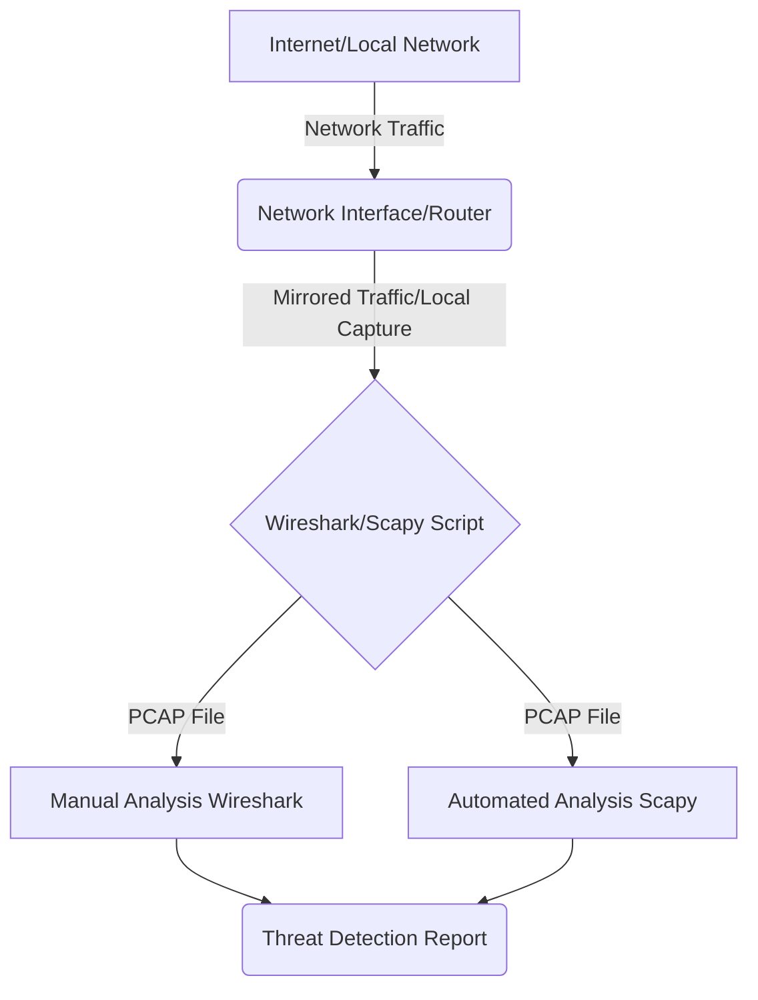

# Tuần 6: Social Engineering & Phishing Header Analysis (CEH v12 Module 09 Aligned)

## Mục Tiêu / Objectives (CEH v12 Aligned)

### Tiếng Việt
- Hiểu được cấu trúc của các gói tin mạng cơ bản (TCP/IP, UDP, ICMP).
- Nắm vững cách sử dụng Wireshark để giám sát và phân tích lưu lượng mạng (Packet Sniffing).
- Nhận diện các dấu hiệu bất thường trên không gian mạng như quét cổng (port scanning) và tấn công từ chối dịch vụ (DoS) ở mức độ cơ bản.
- Ứng dụng Python (thư viện Scapy) để tự động hóa việc đọc và phân tích các tệp dữ liệu mạng (PCAP).
- Rèn luyện tư duy phòng thủ mạng (Defensive Security) thông qua việc phân tích log và dữ liệu lưu lượng.

### English
- Understand the structure of basic network packets (TCP/IP, UDP, ICMP).
- Master the use of Wireshark for network traffic monitoring and analysis (Packet Sniffing).
- Identify abnormal network signs such as port scanning and basic Denial of Service (DoS) attacks.
- Apply Python (Scapy library) to automate reading and analyzing network data files (PCAP).
- Cultivate a defensive security mindset by analyzing logs and traffic data.

---

## Linh Kiện & Dụng Cụ / Components & Tools

### Tiếng Việt
1. **Phần cứng:**
   - Laptop/PC chạy hệ điều hành Windows, macOS hoặc Linux.
   - Kết nối mạng LAN hoặc Wi-Fi.
2. **Phần mềm:**
   - **Wireshark:** Phần mềm phân tích giao thức mạng mã nguồn mở (https://www.wireshark.org/).
   - **Python 3.x:** Môi trường lập trình (ưu tiên phiên bản >= 3.8).
   - Thư viện Python: `scapy` (cài đặt qua lệnh `pip install scapy`).
   - Trình biên dịch: VS Code hoặc Jupyter Notebook.
3. **Dữ liệu mẫu:**
   - Tệp `.pcap` chứa lưu lượng mạng mẫu (được cung cấp bởi giáo viên hoặc tạo ra bằng cách sử dụng các công cụ phòng thủ cục bộ).

### English
1. **Hardware:**
   - Laptop/PC running Windows, macOS, or Linux.
   - LAN or Wi-Fi network connection.
2. **Software:**
   - **Wireshark:** Open-source network protocol analyzer (https://www.wireshark.org/).
   - **Python 3.x:** Programming environment (preferably >= 3.8).
   - Python library: `scapy` (install via `pip install scapy`).
   - IDE: VS Code or Jupyter Notebook.
3. **Sample Data:**
   - A `.pcap` file containing sample network traffic (provided by the instructor or generated using local defensive tools).

---

## Lý Thuyết / Theory

### 1. Phân tích gói tin là gì? / What is Packet Analysis?
**Tiếng Việt:**
Phân tích gói tin (Packet Analysis) hay "Sniffing" là quá trình bắt (capture) và phân tích lưu lượng dữ liệu đi qua một mạng. Trong bảo mật phòng thủ, nó đóng vai trò quan trọng trong việc khắc phục sự cố mạng, xác định nguyên nhân lỗi và phát hiện những hành vi không hợp lệ hoặc các cuộc tấn công nhắm vào hệ thống.
Chúng ta sẽ tập trung vào các giao thức quan trọng:
- **TCP (Transmission Control Protocol):** Đảm bảo truyền tải đáng tin cậy. Bắt tay 3 bước (3-way handshake).
- **UDP (User Datagram Protocol):** Truyền tải không đáng tin cậy nhưng tốc độ cao (ví dụ: video streaming).
- **ICMP (Internet Control Message Protocol):** Sử dụng chủ yếu cho ping và các thông báo lỗi.

**English:**
Packet Analysis or "Sniffing" is the process of capturing and inspecting data traffic passing through a network. In defensive security, it plays a vital role in network troubleshooting, identifying the root cause of issues, and detecting invalid behavior or attacks targeting the system.
We will focus on important protocols:
- **TCP (Transmission Control Protocol):** Ensures reliable transmission. Involves the 3-way handshake.
- **UDP (User Datagram Protocol):** Unreliable but high-speed transmission (e.g., video streaming).
- **ICMP (Internet Control Message Protocol):** Used primarily for ping and error messages.

### 2. Tổng quan về Wireshark / Overview of Wireshark
**Tiếng Việt:**
Wireshark là một trong những công cụ phân tích giao thức mạng hàng đầu. Nó cho phép người dùng xem dữ liệu đang được truyền tải trên một mạng với mức độ chi tiết cao, hiển thị từng gói tin cùng với các trường tiêu đề (headers) và tải trọng (payload) của nó.
Các khái niệm chính:
- **Filter (Bộ lọc):** Cho phép bạn chỉ xem các gói tin đáp ứng các tiêu chí nhất định (ví dụ: `tcp.port == 80`).
- **Promiscuous Mode (Chế độ hỗn tạp):** Cho phép card mạng của máy tính bắt tất cả các gói tin trên mạng chứ không chỉ những gói tin được gửi tới nó (nếu switch/hub hỗ trợ).
- **PCAP (Packet Capture):** Định dạng tệp chuẩn dùng để lưu trữ dữ liệu gói tin mạng đã bắt được.

**English:**
Wireshark is one of the premier network protocol analyzers. It allows users to see what's happening on a network at a microscopic level, displaying individual packets along with their headers and payloads.
Key concepts:
- **Filters:** Allow you to view only packets that meet certain criteria (e.g., `tcp.port == 80`).
- **Promiscuous Mode:** Allows a computer's network interface controller (NIC) to capture all traffic on the network, not just the traffic addressed to it (if the switch/hub supports it).
- **PCAP (Packet Capture):** The standard file format for saving captured network packet data.

### 3. Phát hiện bất thường mạng / Detecting Network Anomalies
**Tiếng Việt:**
Bất thường trong mạng có thể bao gồm lưu lượng tăng đột biến, số lượng lớn các kết nối bị từ chối hoặc việc sử dụng các cổng không tiêu chuẩn.
Một số dấu hiệu cụ thể:
- **Quét cổng (Port Scanning):** Một lượng lớn gói tin TCP SYN được gửi đến nhiều cổng trên một máy chủ mục tiêu trong thời gian ngắn, nhưng ít hoặc không có kết nối TCP hoàn chỉnh nào được thiết lập.
- **Lưu lượng bất thường đến một địa chỉ IP (Possible DoS/DDoS):** Hàng nghìn gói tin giống nhau (ví dụ: ICMP Echo Request hoặc UDP/TCP ngẫu nhiên) làm tràn ngập băng thông hoặc tài nguyên máy chủ.
Trong bài học này, chúng ta phân tích cách thức nhận dạng những hiện tượng này dưới góc độ quản trị viên, qua đó thực hiện các bước phòng ngừa cần thiết như cấu hình tường lửa.

**English:**
Network anomalies can include sudden spikes in traffic, a massive number of refused connections, or the use of non-standard ports.
Some specific indicators:
- **Port Scanning:** A large number of TCP SYN packets sent to multiple ports on a target host in a short time frame, with few or no complete TCP connections established.
- **Abnormal Traffic to an IP (Possible DoS/DDoS):** Thousands of identical packets (e.g., ICMP Echo Requests or random UDP/TCP) overwhelming bandwidth or server resources.
In this lesson, we analyze how to identify these phenomena from an administrator's perspective, thereby taking necessary preventive steps like firewall configuration.

### 4. Sử dụng Python (Scapy) cho phân tích PCAP / Using Python (Scapy) for PCAP Analysis
**Tiếng Việt:**
Thay vì kiểm tra thủ công bằng Wireshark, đôi khi chúng ta cần phân tích các tệp lưu lượng mạng cực lớn. Thư viện Scapy của Python cung cấp một công cụ tuyệt vời để đọc, phân tích và trích xuất dữ liệu từ các tệp `.pcap`. Bằng cách tự động hóa quá trình phát hiện dấu hiệu bất thường (như đếm số lần SYN), các chuyên gia phân tích bảo mật có thể phản ứng nhanh chóng hơn.

**English:**
Instead of manual inspection via Wireshark, sometimes we need to analyze extremely large network traffic files. Python's Scapy library provides an excellent tool for reading, analyzing, and extracting data from `.pcap` files. By automating the detection of anomalies (such as counting SYN flags), security analysts can respond much faster.

---

## Sơ Đồ Cấu Hình / Diagram



**Tiếng Việt:**
Sơ đồ minh họa cách lưu lượng mạng đi qua giao diện và được ghi lại bởi công cụ (Wireshark hoặc Scapy). Sau đó, tệp PCAP được phân tích thủ công hoặc tự động để tạo ra báo cáo về các mối đe dọa (phát hiện xâm nhập).

**English:**
The diagram illustrates how network traffic passes through an interface and is captured by a tool (Wireshark or Scapy). The PCAP file is then manually or automatically analyzed to generate a threat detection report.

---

## Thực Hành / Hands-On

### Phần 1: Bắt và Phân tích gói tin cơ bản bằng Wireshark / Part 1: Basic Packet Capture and Analysis with Wireshark

**Tiếng Việt:**
1. Khởi động phần mềm **Wireshark**.
2. Chọn Giao diện mạng (Network Interface) đang hoạt động (ví dụ: Wi-Fi hoặc Ethernet).
3. Bắt đầu quá trình thu thập (Capture).
4. Mở trình duyệt web và truy cập một trang web không bảo mật (http://example.com) để quan sát lưu lượng văn bản thuần, và một trang bảo mật (https://google.com) để quan sát lưu lượng mã hóa (TLS).
5. Mở Command Prompt hoặc Terminal, gõ lệnh `ping google.com` để xem các gói tin ICMP.
6. Dừng quá trình thu thập trong Wireshark.
7. Sử dụng Bộ lọc (Display Filters):
   - Nhập `http` vào thanh lọc. Xem sự khác biệt của lưu lượng không mã hóa.
   - Nhập `icmp` để chỉ hiển thị kết quả lệnh ping.
   - Nhập `tcp.flags.syn == 1` để xem các yêu cầu khởi tạo kết nối.
8. Lưu tệp dưới định dạng `sample_traffic.pcap` cho phần thực hành sau.

**English:**
1. Launch **Wireshark**.
2. Select the active Network Interface (e.g., Wi-Fi or Ethernet).
3. Start the Capture process.
4. Open a web browser and visit an insecure HTTP site (http://example.com) to observe plaintext traffic, and a secure site (https://google.com) to observe encrypted traffic (TLS).
5. Open Command Prompt or Terminal, type `ping google.com` to see ICMP packets.
6. Stop the capture in Wireshark.
7. Use Display Filters:
   - Type `http` into the filter bar. Notice the difference in unencrypted traffic.
   - Type `icmp` to display only the ping results.
   - Type `tcp.flags.syn == 1` to view connection initialization requests.
8. Save the file as `sample_traffic.pcap` for the next part of the hands-on.

### Phần 2: Phát hiện dấu hiệu quét cổng thủ công / Part 2: Manual Port Scan Detection

**Tiếng Việt:**
Mục tiêu: Đóng vai một quản trị viên đang xem lại file PCAP bị tình nghi.
1. Mở tệp PCAP được nghi ngờ có hoạt động quét cổng (giáo viên sẽ cung cấp tệp `port_scan_sample.pcap`).
2. Sử dụng bộ lọc: `tcp.flags.syn==1 and tcp.flags.ack==0`.
3. Kiểm tra xem có cùng một địa chỉ IP nguồn (Source) đang gửi yêu cầu SYN đến nhiều cổng đích (Destination Port) khác nhau trong thời gian rất ngắn hay không.
4. Mở tính năng `Statistics -> Conversations`. Phân tích mục IPv4 và TCP. Nếu bạn thấy số lượng lớn các kết nối từ một IP đến hàng loạt port nhưng với số byte rất nhỏ, đó chính là dấu hiệu quét cổng kinh điển.

**English:**
Objective: Act as a system administrator reviewing a suspicious PCAP file.
1. Open the PCAP file suspected of containing a port scan (instructor will provide `port_scan_sample.pcap`).
2. Use the filter: `tcp.flags.syn==1 and tcp.flags.ack==0`.
3. Check if the same Source IP address is sending SYN requests to many different Destination Ports within a very short timeframe.
4. Open `Statistics -> Conversations`. Analyze the IPv4 and TCP tabs. If you see a massive amount of connections from one IP to numerous ports but with very small bytes transferred, that is a classic sign of a port scan.

### Phần 3: Phân tích tự động với Python / Part 3: Automated Analysis with Python

**Tiếng Việt:**
Cài đặt thư viện Scapy. Trong môi trường ảo (Virtual Environment), chạy:
```bash
pip install scapy
```
Viết một đoạn script Python đơn giản để đếm số lượng các gói tin SYN từ mỗi IP. Khi một IP gửi quá nhiều SYN (vượt qua một ngưỡng - Threshold), chúng ta có thể kết luận rằng đó có thể là một máy quét (Scanner) hoặc một dấu hiệu nguy hiểm.

**English:**
Install the Scapy library. In a virtual environment, run:
```bash
pip install scapy
```
Write a simple Python script to count the number of SYN packets from each IP. When an IP sends too many SYN packets (exceeding a threshold), we can conclude it might be a scanner or a dangerous anomaly.

---

## Code Mẫu / Code Samples

**Tiếng Việt:**
Đoạn code sau đây sử dụng thư viện Scapy để đọc một tệp PCAP, phân tích tất cả các gói tin TCP và kiểm đếm số lượng cờ SYN (khởi tạo kết nối) mà mỗi địa chỉ IP nguồn gửi đi. Script này tập trung hoàn toàn vào việc phòng thủ: phát hiện mối đe dọa bằng cách xem xét log một cách thụ động, không can thiệp vào mạng hay phát động tấn công.

**English:**
The following code uses the Scapy library to read a PCAP file, analyze all TCP packets, and tally the number of SYN flags (connection initialization) sent by each source IP address. This script focuses entirely on defense: threat detection by passively reviewing logs without interfering with the network or launching any attacks.

```python
# pcap_analyzer.py
# Defensive Security Tool: Basic Port Scan & Anomaly Detector
# Author: Aero-Fullstack4kid Course

import sys
from collections import defaultdict
try:
    from scapy.all import rdpcap, TCP, IP
except ImportError:
    print("Scapy is not installed. Please run: pip install scapy")
    sys.exit(1)

def analyze_pcap_for_syn_scans(pcap_file, syn_threshold=50):
    """
    Tiếng Việt: Hàm phân tích file pcap để tìm dấu hiệu quét cổng (nhiều cờ SYN)
    English: Function to analyze a pcap file for port scan signatures (excessive SYN flags)
    """
    print(f"[*] Đang tải tệp: {pcap_file} ... (Vui lòng đợi) / Loading file: {pcap_file} ... (Please wait)")
    try:
        packets = rdpcap(pcap_file)
    except FileNotFoundError:
        print(f"[-] Lỗi: Không tìm thấy tệp / Error: File not found: {pcap_file}")
        sys.exit(1)
        
    print(f"[+] Tổng số gói tin đã tải / Total packets loaded: {len(packets)}")
    
    # Dictionary to keep track of SYN packets from each Source IP
    # Dictionary dùng để lưu trữ số lượng gói tin SYN từ mỗi IP nguồn
    syn_counts = defaultdict(int)
    
    print("[*] Bắt đầu phân tích lưu lượng / Starting traffic analysis...")
    for pkt in packets:
        # Kiểm tra xem gói tin có chứa cả lớp IP và TCP không
        # Check if the packet contains both IP and TCP layers
        if IP in pkt and TCP in pkt:
            # Lấy cờ TCP / Extract TCP flags
            # Chuyển cờ thành chuỗi (ví dụ: 'S' cho SYN, 'A' cho ACK)
            # Convert flags to a string (e.g., 'S' for SYN, 'A' for ACK)
            flags = pkt[TCP].flags
            
            # Nếu cờ chỉ chứa SYN (giá trị là 2 hoặc 'S' trong hiển thị của Scapy)
            # If the flag contains exactly 'S' (SYN without ACK)
            if 'S' in flags and 'A' not in flags:
                src_ip = pkt[IP].src
                syn_counts[src_ip] += 1
                
    # Hiển thị kết quả / Display results
    print("\n--- KẾT QUẢ PHÂN TÍCH / ANALYSIS RESULTS ---")
    suspicious_ips = []
    
    for ip, count in syn_counts.items():
        if count > syn_threshold:
            print(f"[CẢNH BÁO / WARNING] IP {ip} đã gửi {count} gói tin SYN (Vượt ngưỡng / Exceeds threshold)")
            suspicious_ips.append(ip)
        else:
            # Optionally show normal traffic
            pass

    if not suspicious_ips:
        print("[+] Không phát hiện dấu hiệu quét cổng đáng ngờ nào. / No suspicious port scanning detected.")
    else:
        print(f"\n[!] Hành động khuyến nghị (Defensive Action): Cân nhắc thêm các IP trên vào danh sách đen (Blocklist) của Tường lửa (Firewall).")
        print(f"[!] Recommended Action: Consider adding these IPs to the Firewall Blocklist.")

if __name__ == "__main__":
    # Thay đổi đường dẫn tới file pcap thực tế của bạn
    # Change path to your actual pcap file
    TARGET_PCAP = "sample_traffic.pcap" 
    # Đặt ngưỡng số lượng gói SYN để đánh giá là bất thường (Tùy thuộc vào quy mô mạng)
    # Set threshold for anomalous SYN packets (Depends on network scale)
    THRESHOLD = 20 
    
    analyze_pcap_for_syn_scans(TARGET_PCAP, THRESHOLD)
```

---

## Câu Hỏi Thảo Luận / Discussion

### Tiếng Việt
1. Tại sao việc bắt và phân tích gói tin lại là một kỹ năng thiết yếu đối với kỹ sư an ninh mạng phòng thủ (Blue Team)?
2. Làm thế nào để kẻ tấn công có thể "ẩn mình" khi quét cổng, và làm thế nào để chúng ta cấu hình tường lửa (firewall) hoặc bộ phát hiện xâm nhập (IDS) để phát hiện ra chúng?
3. Nếu một nhân viên IT trong mạng công ty truy cập vào một trang web HTTP (không phải HTTPS), rủi ro lớn nhất mà công ty gặp phải là gì? Hãy chứng minh điều đó dựa trên những gì bạn đã thấy trong Wireshark.
4. Python và Scapy mang lại lợi thế gì so với việc chỉ sử dụng giao diện đồ họa của Wireshark khi xử lý các sự cố mạng lớn?

### English
1. Why is packet capturing and analysis an essential skill for defensive cybersecurity engineers (Blue Team)?
2. How might attackers attempt to "stealth" their port scans, and how can we configure our firewalls or Intrusion Detection Systems (IDS) to detect them?
3. If an IT employee on a corporate network visits an HTTP site (not HTTPS), what is the greatest risk to the company? Prove it based on what you saw in Wireshark.
4. What advantages do Python and Scapy offer over merely using the Wireshark GUI when dealing with massive network incidents?

---

## Bài Về Nhà / Homework

### Tiếng Việt
1. **Thực hành Mạng Thực Tế:** 
   Sử dụng Wireshark tại nhà (trên mạng cá nhân của bạn, **không phải mạng trường học hay công cộng**). Bắt lưu lượng mạng trong 3 phút.
   * Lọc và tìm ít nhất 1 kết nối HTTPS (TCP port 443).
   * Lọc và tìm lưu lượng DNS (UDP port 53).
   * Viết một báo cáo ngắn (tối đa 1 trang) chụp màn hình (screenshot) những kết quả trên và giải thích vì sao DNS lại sử dụng UDP thay vì TCP cho các truy vấn thông thường.

2. **Lập trình Python Bổ Sung:**
   Mở rộng đoạn code Python (Scapy) được cung cấp trong bài. Ngoài việc đếm gói tin SYN, hãy đếm tổng số các gói tin ICMP (Ping) đến từ các IP khác nhau. Mục đích là để phát hiện dấu hiệu của hành vi "Ping Sweep" (Quét Ping để tìm các máy chủ đang hoạt động).
   *Gợi ý:* Trong vòng lặp for, thêm một nhánh `elif ICMP in pkt:`.

### English
1. **Real-world Network Practice:**
   Use Wireshark at home (on your personal network, **not a school or public network**). Capture network traffic for 3 minutes.
   * Filter and find at least 1 HTTPS connection (TCP port 443).
   * Filter and find DNS traffic (UDP port 53).
   * Write a short report (max 1 page) with screenshots of these findings and explain why DNS generally uses UDP instead of TCP for standard queries.

2. **Additional Python Programming:**
   Extend the provided Python (Scapy) code. In addition to counting SYN packets, count the total number of ICMP (Ping) packets originating from different IPs. The goal is to detect signs of a "Ping Sweep" (pinging multiple hosts to see who is alive).
   *Hint:* In the for loop, add an `elif ICMP in pkt:` branch.

---

## Đánh Giá / Assessment Rubric

| Tiêu Chí / Criteria | Đạt / Pass (70-100%) | Không Đạt / Fail (<70%) |
| :--- | :--- | :--- |
| **Sử dụng Wireshark (Wireshark Usage)** | Biết cách khởi động, chọn interface, bắt gói tin và sử dụng thành thạo các bộ lọc cơ bản (tcp, udp, port). / Knows how to start, select interface, capture packets, and fluently use basic filters. | Không thể sử dụng bộ lọc, không thể chụp gói tin thành công. / Cannot use filters, fails to capture packets successfully. |
| **Phân tích giao thức (Protocol Analysis)** | Phân biệt rõ ràng được sự khác nhau giữa TCP (cờ SYN, ACK) và UDP, hiểu rõ ICMP. / Clearly distinguishes between TCP (SYN, ACK flags) and UDP, understands ICMP. | Lúng túng trong việc giải thích cấu trúc cơ bản của gói tin, nhầm lẫn TCP và UDP. / Confused in explaining basic packet structure, confuses TCP and UDP. |
| **Thực hành Code (Coding Practice)** | Chạy thành công đoạn script Python/Scapy, hiểu logic kiểm đếm bất thường và có khả năng sửa đổi các ngưỡng báo động (Threshold). / Successfully runs Python/Scapy script, understands the anomaly counting logic, and can modify alarm thresholds. | Code báo lỗi thư viện không thể khắc phục, hoặc không hiểu đoạn mã kiểm tra điều kiện gì. / Unresolvable library errors in code, or does not understand what the code is checking. |
| **Tư duy Phòng thủ (Defensive Mindset)** | Chỉ sử dụng các công cụ phân tích để phát hiện và ngăn chặn, tuân thủ đúng nguyên tắc an toàn thông tin (chỉ kiểm tra máy nhà/lab). / Uses analysis tools solely for detection and prevention, strictly follows info-sec ethics (only testing home/lab). | Sử dụng sai mục đích, sử dụng công cụ tấn công trên hệ thống thật mà không có phép. / Misuse, using offensive tools on real systems without permission. (Immediate Fail) |

---
*Ghi chú cho Giảng Viên (Instructor Notes):*
- Đảm bảo học viên hiểu sự khác biệt giữa *bắt lưu lượng mạng thụ động* và *chủ động quét mạng*. 
- Nếu môi trường lớp học hạn chế quyền Admin/Root để chạy Wireshark ở chế độ Promiscuous, hãy chuẩn bị sẵn các file `.pcap` chất lượng để học viên tải về và tập trung vào kỹ năng phân tích bằng các bộ lọc.
- Ensure students understand the difference between *passive packet sniffing* and *active network scanning*.
- If the classroom environment restricts Admin/Root privileges to run Wireshark in Promiscuous mode, prepare high-quality `.pcap` files for students to download and focus on analysis skills using filters.

---

## Phụ Lục Chuyên Sâu (Deep-Dive Appendix): Wireshark Display Filters & TCP Flags Reference

### 1. Bảng Tra Cứu Bộ Lọc Wireshark Phổ Biến (Wireshark Display Filters)

| Mục tiêu lọc (Filter Objective) | Cú pháp Wireshark (Filter Syntax) | Ý nghĩa (Description) |
| :--- | :--- | :--- |
| **Theo IP nguồn** | `ip.src == 192.168.1.100` | Lọc các gói tin xuất phát từ IP cụ thể |
| **Theo IP đích** | `ip.dst == 127.0.0.1` | Lọc các gói tin có đích đến là IP cụ thể |
| **Theo Cổng TCP** | `tcp.port == 80 || tcp.port == 443` | Lọc lưu lượng Web (HTTP/HTTPS) |
| **Gói SYN (Khởi tạo kết nối)** | `tcp.flags.syn == 1 && tcp.flags.ack == 0` | Rất hữu ích để phát hiện hành vi Port Scanning |
| **Gói RST (Từ chối kết nối)** | `tcp.flags.reset == 1` | Phát hiện cổng đóng hoặc bị chặn bởi Firewall |
| **Lọc DNS Queries** | `dns.flags.response == 0` | Chỉ hiển thị các yêu cầu truy vấn tên miền |

### 2. Ý Nghĩa Các Cờ TCP (TCP Flags Summary)

- **SYN (Synchronize):** Yêu cầu khởi tạo kết nối (Bắt tay bước 1).
- **ACK (Acknowledgment):** Xác nhận đã nhận dữ liệu hoặc gói SYN/FIN.
- **FIN (Finish):** Yêu cầu đóng kết nối một cách êm đẹp.
- **RST (Reset):** Ngắt kết nối ngay lập tức (thường do cổng đóng hoặc lỗi mạng).
## 20 code minh họa của tuần

- [Mở mục lục code tuần 06](../code/week06/README.md), học lần lượt từ `01_...` đến `20_...`.

<!-- AUTO-GENERATED-WEEKLY-CODE -->
## 20 code minh họa của tuần

- [Mở mục lục code tuần 06](../code/week06/README.md), học lần lượt từ `01_...` đến `20_...`.
